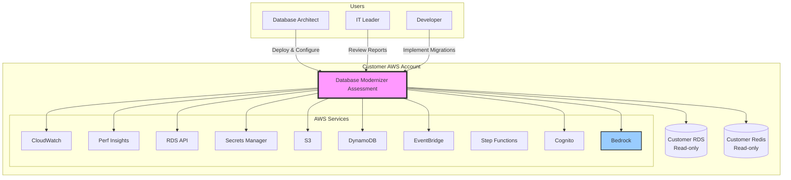

# System Context

External actors and systems for Database Modernizer Assessment (Phase 0).

## Key Points

- Runs in customer VPC with direct private connectivity to their RDS/Redis (read-only)
- Does NOT deploy its own database instances
- Bedrock and Cognito are required
- S3/DynamoDB accessed via VPC gateway endpoints

---

**Related:** [VPC Deployment](02-vpc-deployment.md) | [High-Level Design](../high-level-design.md)
