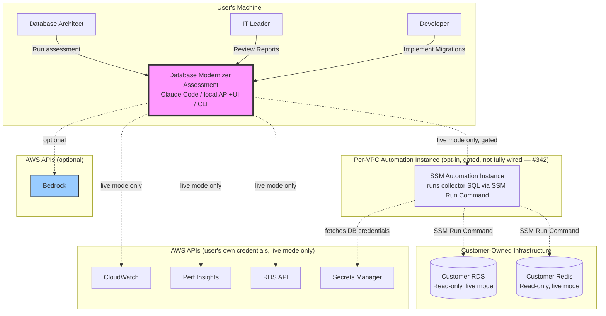

# System Context

External actors and systems for Database Modernizer Assessment. Runs
local-first — on the user's machine via Claude Code, the local API/UI, or
the deterministic CLI — not as a hosted service in a customer AWS account
(the prior hosted deployment was retired, [#175](https://github.com/aws-samples/sample-aws-genai-db-modernizer/issues/175)).

```mermaid
graph TB
    subgraph "User's Machine"
        DBA[Database Architect]
        ITL[IT Leader]
        DEV[Developer]
        DBM[Database Modernizer Assessment<br/>Claude Code / local API+UI / CLI]
    end

    subgraph "Per-VPC Automation Instance (opt-in, gated, not fully wired — #342)"
        AUTO[SSM Automation Instance<br/>runs collector SQL via SSM Run Command]
    end

    subgraph "Customer-Owned Infrastructure"
        RDS[(Customer RDS<br/>Read-only, live mode)]
        REDIS[(Customer Redis<br/>Read-only, live mode)]
    end

    subgraph "AWS APIs (user's own credentials, live mode only)"
        CW[CloudWatch] & PI[Perf Insights] & RDS_API[RDS API]
        SM[Secrets Manager]
    end

    subgraph "AWS APIs (optional)"
        BEDROCK[Bedrock]
    end

    DBA -->|Run assessment| DBM
    ITL -->|Review Reports| DBM
    DEV -->|Implement Migrations| DBM

    DBM -.->|live mode only, gated| AUTO
    AUTO -.->|SSM Run Command| RDS & REDIS
    DBM -.->|live mode only| CW & PI & RDS_API
    AUTO -.->|fetches DB credentials| SM
    DBM -.->|optional| BEDROCK

    style DBM fill:#f9f,stroke:#333,stroke-width:4px
    style BEDROCK fill:#9cf,stroke:#333,stroke-width:2px
```

## Key Points

- Live-mode collection never connects to RDS/Redis directly from wherever
  the tool runs. It runs through SSM Run Command on a per-VPC automation
  EC2 instance (`infrastructure/cloudformation/automation.yaml`,
  `src/tools/aws/ssm_executor.py`). That path is gated behind
  `MODERNIZER_ENABLE_AUTOMATION=1` and not fully wired end-to-end yet
  ([#342](https://github.com/aws-samples/sample-aws-genai-db-modernizer/issues/342))
- Offline/DDL collection modes need no database connectivity at all, and work today
- Does NOT deploy its own database instances
- Bedrock is optional (`--llm-mode none` skips it entirely)
- No hosted account, no Cognito, no S3/DynamoDB/EventBridge/Step Functions in the default path — those existed only in the retired hosted deployment. The separate AWS Transform integration (`src/atx_orchestrator/`) does use S3, independent of this diagram's local path.

---

**Related:** [High-Level Design](../high-level-design.md)
