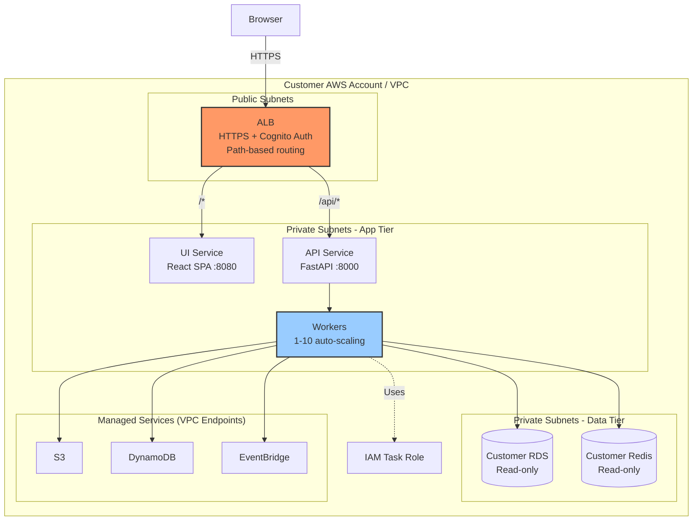

# ECS Fargate Deployment (Primary)

Customer VPC deployment using ECS Fargate. Deployed via CloudFormation.

## Why ECS Fargate

- Direct VPC connectivity to private databases (no VPN needed)
- IAM roles for AWS service access (no credential management)
- Auto-scaling workers, serverless containers
- S3/DynamoDB via VPC gateway endpoints (no NAT traversal)

## Key Details

- Customer RDS/Redis accessed read-only — we don't deploy our own databases
- ALB uses path-based routing (`/api/*` → API, `/*` → UI) with Cognito auth on all routes
- Python 3.12+, Bedrock required, OpenTelemetry for tracing

---

**Related:** [CloudFormation Deployment](12-cloudformation-deployment.md) | [Docker Compose](03-docker-compose-deployment.md)
