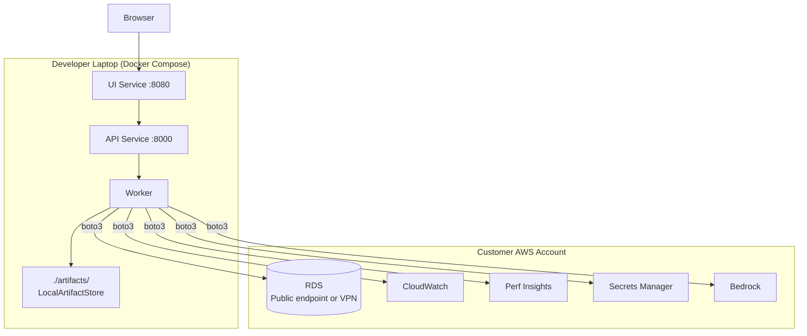

# Docker Compose Deployment (Development)

Local development and demos only. Not for production.

## Limitations

- Requires public RDS endpoint or VPN (private RDS won't work)
- AWS credentials stored on laptop
- Limited to 1-2 concurrent jobs
- Best for: local dev, demos, quick evaluation

## Prerequisites

- Docker Desktop, AWS CLI configured
- Network access to RDS
- IAM permissions: rds:Describe*, cloudwatch:*, pi:*, secretsmanager:*, bedrock:*, cognito-idp:*, events:*

---

**Related:** [ECS Fargate Deployment](02-vpc-deployment.md)
