# Agent Framework

Multi-agent architecture using Strands SDK with Step Functions orchestration per [ADR-016](../decisions/ADR-016-compute-and-orchestration-strategy.md).

```mermaid
graph TB
    ORCH[Step Functions<br/>Job Orchestrator]

    subgraph "Collectors"
        MYSQL[MySQL] & POSTGRES[PostgreSQL] & REDIS_C[Redis]
        MARIADB[MariaDB] & SQLSERVER[SQL Server] & ORACLE[Oracle] & DB2[DB2]
        MINI[Mini-Collectors<br/>1000+ tables]
    end

    subgraph "Referee-Triage"
        TRIAGE[Triage Agent<br/>Selects relevant analyses]
    end

    GATE1[Human Gate 1<br/>WaitForTriageApproval]

    subgraph "RunAnalysisPipelines Map (per engine)"
        subgraph "Per-Engine Analysis"
            SCHEMA_A[Schema] & PERF[Performance] & AURORA_A[Aurora MySQL] & AURORA_PG[Aurora PostgreSQL]
            RDS_A[RDS] & COST[Cost] & SECURITY[Security] & ADDITIONAL[Additional]
        end
    end

    AR[Assignment Resolution]
    RC[Reality Check<br/>incl. Aurora Absorption Pass]

    GATE2[Human Gate 2<br/>WaitForAssignmentApproval]

    subgraph "RunSchemaDesignPipelines Map (per engine)"
        subgraph "Per-Engine Schema Design"
            DYNAMODB[DynamoDB Schema Design] & DOCUMENTDB[DocumentDB Schema Design]
            OPENSEARCH[OpenSearch Schema Design] & ELASTICACHE[ElastiCache Schema Design]
        end
    end

    subgraph "RunLoadTestPipelines Map (per engine)"
        LOADTEST[Load Test Agent<br/>k6-based]
    end

    subgraph "Referee-Synthesis"
        SYNTH[Synthesis Agent<br/>Weighted ranking + confidence]
    end

    subgraph "Strands SDK"
        AGENT[Agent] --> TOOLS[Custom Tools] & PROMPTS[System Prompts] & CONTRACTS[Pydantic Contracts]
        AGENT --> BEDROCK[Bedrock LLM]
    end

    ORCH --> MYSQL & POSTGRES & REDIS_C
    MYSQL -.->|large DBs| MINI
    ORCH --> TRIAGE
    TRIAGE --> GATE1
    GATE1 -->|approved| ORCH
    ORCH -->|RunAnalysisPipelines Map| SCHEMA_A & PERF & AURORA_A & AURORA_PG & RDS_A & COST & SECURITY & ADDITIONAL
    ORCH --> AR
    AR --> RC
    RC --> GATE2
    GATE2 -->|approved| ORCH
    ORCH -->|RunSchemaDesignPipelines Map| DYNAMODB & DOCUMENTDB & OPENSEARCH & ELASTICACHE
    DYNAMODB & DOCUMENTDB & OPENSEARCH & ELASTICACHE -.->|PE review loop| DYNAMODB & DOCUMENTDB & OPENSEARCH & ELASTICACHE
    ORCH -->|RunLoadTestPipelines Map| LOADTEST
    ORCH --> SYNTH
    SYNTH -.->|deeper analysis?| ORCH

    style ORCH fill:#f96,stroke:#333,stroke-width:3px
    style TRIAGE fill:#fc9,stroke:#333,stroke-width:2px
    style SYNTH fill:#fc9,stroke:#333,stroke-width:2px
    style GATE1 fill:#fd7,stroke:#333,stroke-width:2px
    style GATE2 fill:#fd7,stroke:#333,stroke-width:2px
    style AR fill:#cfc,stroke:#333,stroke-width:2px
    style RC fill:#cfc,stroke:#333,stroke-width:2px
```

## Agent Categories

| Category | Agents | Execution |
|----------|--------|-----------|
| Collectors | MySQL, PostgreSQL, MariaDB, SQL Server, Oracle, DB2, Redis | One per job, can spawn mini-collectors |
| Referee-Triage | Single agent | After collector; selects relevant engine pipelines |
| Human Gate 1 | WaitForTriageApproval | Pauses execution after triage; resumes on human approval via UI |
| Analysis | Schema, Performance, Aurora MySQL, Aurora PostgreSQL, RDS, Cost, Security, Additional | Per-engine, inside RunAnalysisPipelines Map state |
| Assignment Resolution | Single agent | After analysis map; determines target engine assignments |
| Reality Check | Single agent (includes Aurora Absorption Pass) | After assignment resolution; validates feasibility |
| Human Gate 2 | WaitForAssignmentApproval | Pauses execution after reality check; resumes on human approval via UI |
| Schema Design | DynamoDB, OpenSearch, ElastiCache, DocumentDB | Per-engine, inside RunSchemaDesignPipelines Map state; includes PE review loop |
| Load Test | k6-based agent | Per-engine, inside RunLoadTestPipelines Map state |
| Referee-Synthesis | Single agent | After all pipelines; weighted ranking, may request deeper analysis (max 2 iterations) |

## Strands SDK

Agents = Strands Agent + Custom Tools + System Prompts + Pydantic Contracts. Tools are reusable across agents. Behavior (prompts) separated from capabilities (tools). Bedrock for LLM, OpenTelemetry for tracing.

---

**Related:** [Workflow Sequence](05-workflow-sequence.md) | [Orchestration Architecture](11-orchestration-architecture.md) | [Mini-Collectors](09-mini-collectors.md)
