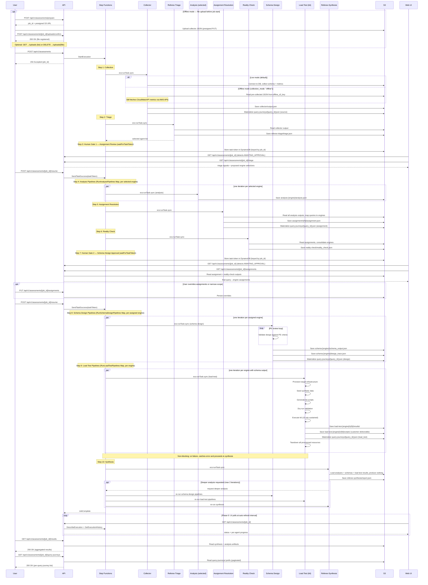

# Workflow Sequence

Job submission to completion using Step Functions orchestration per [ADR-016](../decisions/ADR-016-compute-and-orchestration-strategy.md).

## Key Design Points

- Step Functions orchestrates the workflow (not EventBridge)
- Referee-Triage selects which engines to evaluate (not always all 7)
- **Two human gates** pause execution via `waitForTaskToken`:
  - Gate 1 (after triage): user reviews engine selections before analysis
  - Gate 2 (after reality check): user reviews final assignments before schema design
- RunAnalysisPipelines Map runs analysis per selected engine
- RunSchemaDesignPipelines Map runs schema design per assigned engine (with group split/merge for large workloads)
- RunLoadTestPipelines Map runs load testing per engine — non-blocking on failure
- Query journey files are progressively enriched at each stage (collector, assignment, design, load test)
- Referee-Synthesis produces weighted ranking, may request deeper analysis (reruns schema design + load test + synthesis)
- Phase 0 uses polling (`GET /api/v1/assessments/{job_id}`) — per-agent status derived from Step Functions execution history
- EventBridge mini-step progress and WebSocket push deferred to Phase 1

---

**Related:** [Orchestration Architecture](11-orchestration-architecture.md) | [Progress Reporting](10-progress-reporting.md) | [ADR-016](../decisions/ADR-016-compute-and-orchestration-strategy.md) | [ADR-019](../decisions/ADR-019-query-journey-materialization.md) | [ADR-020](../decisions/ADR-020-load-testing-stage.md)
