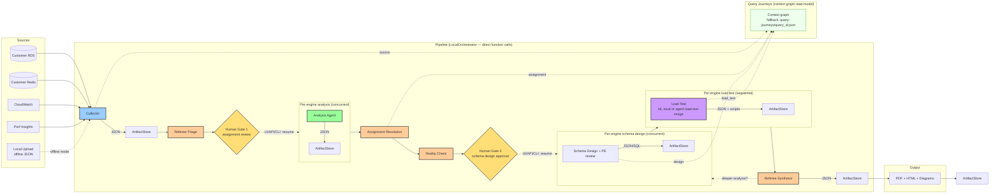

# Data Flow

Source databases → Collector → Triage → Human Gate 1 → Analysis (concurrent) → Assignment Resolution → Reality Check → Human Gate 2 → Schema Design → Load Test (sequential) → Synthesis → Reports. `LocalOrchestrator` runs each phase as a direct function call — there is no workflow service or event bus. The Collector supports two input modes: live (SQL run via SSM Run Command on a per-VPC automation instance — opt-in, gated, not fully wired; see [High-Level Design §7.1](../high-level-design.md#71-security-overview)) and offline (pre-collected JSON). Query journey detail is served from the context graph read-model, with a fallback to progressive per-stage files for jobs that predate it.


```mermaid
graph LR
    subgraph "Sources"
        RDS[(Customer RDS)] & REDIS[(Customer Redis)]
        CW[CloudWatch] & PI[Perf Insights]
        UPLOAD[Local Upload<br/>offline JSON]
    end

    subgraph "Pipeline (LocalOrchestrator — direct function calls)"
        COLLECTOR[Collector] -->|JSON| STORE_1[ArtifactStore]
        STORE_1 --> TRIAGE[Referee-Triage]
        TRIAGE --> GATE1{Human Gate 1<br/>assignment review}
        GATE1 -.->|UI/API/CLI: resume| ANALYSIS_MAP
        subgraph ANALYSIS_MAP["Per-engine analysis (concurrent)"]
            ANALYSIS[Analysis Agent] -->|JSON| STORE_2[ArtifactStore]
        end
        ANALYSIS_MAP --> AR[Assignment Resolution]
        AR --> RC[Reality Check]
        RC --> GATE2{Human Gate 2<br/>schema design approval}
        GATE2 -.->|UI/API/CLI: resume| SCHEMA_MAP
        subgraph SCHEMA_MAP["Per-engine schema design (concurrent)"]
            SCHEMA[Schema Design + PE review] -->|JSON/SQL| STORE_3a[ArtifactStore]
        end
        SCHEMA_MAP --> LOAD_MAP
        subgraph LOAD_MAP["Per-engine load test (sequential)"]
            LOADTEST[Load Test<br/>k6, local or agent-load-test image] -->|JSON + scripts| STORE_LT[ArtifactStore]
        end
        LOAD_MAP --> SYNTH[Referee-Synthesis]
        SYNTH -->|JSON| STORE_3[ArtifactStore]
        SYNTH -.->|deeper analysis?| SCHEMA_MAP
    end

    subgraph "Query Journeys (context graph read-model)"
        QJ[Context graph<br/>fallback: query-journeys/query_id.json]
        COLLECTOR -.->|source| QJ
        AR -.->|assignment| QJ
        SCHEMA -.->|design| QJ
        LOADTEST -.->|load_test| QJ
    end

    subgraph "Output"
        REPORT[PDF + HTML + Diagrams]
    end

    RDS & REDIS & CW & PI --> COLLECTOR
    UPLOAD -.->|offline mode| COLLECTOR
    STORE_3 --> REPORT --> STORE_5[ArtifactStore]

    style COLLECTOR fill:#9cf,stroke:#333,stroke-width:2px
    style TRIAGE fill:#fc9,stroke:#333,stroke-width:2px
    style ANALYSIS fill:#9f9,stroke:#333,stroke-width:2px
    style GATE1 fill:#fd7,stroke:#333,stroke-width:2px
    style GATE2 fill:#fd7,stroke:#333,stroke-width:2px
    style AR fill:#fc9,stroke:#333,stroke-width:2px
    style RC fill:#fc9,stroke:#333,stroke-width:2px
    style SYNTH fill:#fc9,stroke:#333,stroke-width:2px
    style LOADTEST fill:#c9f,stroke:#333,stroke-width:2px
    style QJ fill:#efe,stroke:#393,stroke-width:1px
```

## Artifact Structure

`job_id` is a UUID — the API uses a full `uuid.uuid4()`; the local scripts and skills truncate it to 8 hex characters. `{database-name}` must exactly match the real database name — in live mode this comes from `connection.database`; in offline mode from `metadata.source_database.database_name` in the collected JSON. A mismatch causes table ID mismatches across collector, assignment resolver, and schema design agents.

Default path is the local filesystem (`LocalArtifactStore`, `./artifacts/` by
default); the AWS Transform integration uses the same layout in S3
(`S3ArtifactStore`):

```
{artifact-root}/{database-name}/{job-id}/
├── collector/output.json
├── referee-triage/triage.json
├── analysis-{engine}/analysis.json          (one per selected engine)
├── assignment/v{N}/assignment.json          (versioned — increments on reality-check revisions)
├── reality-check/output.json
├── schema-{engine}/v{N}/schema_output.json  (one per assigned engine)
├── schema-{engine}/v{N}/design_trace.json
├── load-test-{engine}/v{N}/
│   ├── config.json
│   ├── infrastructure.json
│   ├── seed-manifest.json
│   ├── k6_diagnostics.json
│   ├── result.json
│   ├── scenarios/                           (customer deliverable — k6 scripts)
│   │   └── {query_id}.js
│   └── results/
│       ├── summary.json
│       └── {query_id}.json                  (per-pattern latency + cost)
├── query-journeys/
│   └── {query_id}.json                      (progressive: source → assignment → design → load_test; legacy fallback)
├── uploads/                                 (offline mode only)
│   └── collector-output.json
├── referee-synthesis/report.json
├── report.pdf
└── report.html
```

Job metadata (status, timestamps) and phase progression
(`collect_triage → analysis → assignment → reality_check → assignment_review → schema_design → load_test → synthesis`)
live in a local progression file next to the job's artifacts — there is no
DynamoDB table and no Step Functions task token; the two human gates are
resumed through the local API/UI, the deterministic CLI, or a Claude Code
command. All data formats: JSON (Pydantic validated), PDF, HTML, PNG, SQL,
JavaScript (k6 scripts).

---

**Related:** [Storage Architecture](07-storage-architecture.md) | [Workflow Sequence](05-workflow-sequence.md) (superseded — see banner) | [ADR-019](../decisions/ADR-019-query-journey-materialization.md) | [ADR-020](../decisions/ADR-020-load-testing-stage.md)
