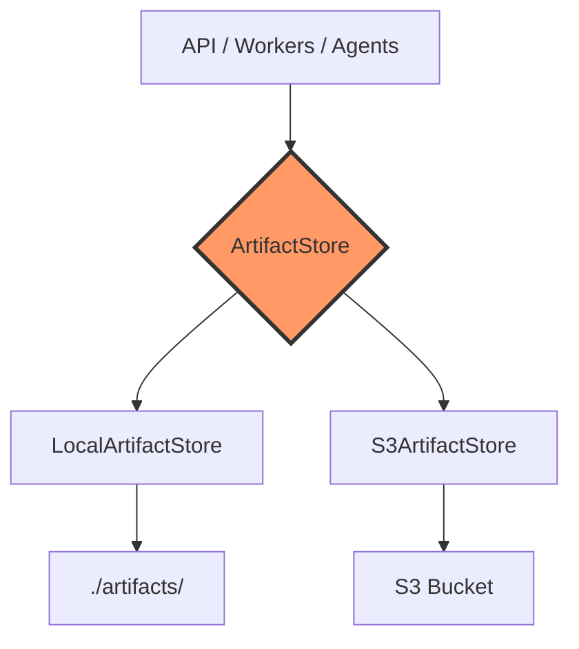

# Storage Architecture

Pluggable storage backends via abstraction layer.



## Interface

```python
class ArtifactStore(ABC):
    def read_json(path: str) -> dict
    def write_json(path: str, data: dict) -> None
    def exists(path: str) -> bool
    def list_prefix(prefix: str) -> list[str]
```

## Backends

| Deployment | Storage | Artifact Path |
|------------|---------|---------------|
| Local (dev) | Filesystem `./artifacts/` | `{db}/{job}/{agent}/artifact.json` |
| AWS (prod) | S3 | `s3://{bucket}/{db}/{job}/{agent}/artifact.json` |

## File Structure

Per [API specification](../api-specification.md):

```
uploads/{database-name}/                    ← presigned upload area (offline mode)
└── collection-output.json

{database-name}/{job_id}/                   ← pipeline artifacts
├── collector/output.json
├── referee-triage/triage.json
├── analysis-{type}/analysis.json
├── assignment/v{N}/                        ← versioned assignment snapshots
├── reality-check/                          ← reality check output
├── query-journeys/                         ← materialized query journey files
├── referee-synthesis/report.json
├── schema-{target}/schema.json
├── load-test-{engine}/                     ← load test results (k6-based)
├── report.pdf
└── report.html
```

`job_id` is a UUID assigned at `POST /api/v1/assessments/prepare` (pre-upload flow) or `POST /api/v1/assessments` (direct start). `{database-name}` must exactly match the real database name — live mode uses `connection.database`; offline mode uses `metadata.source_database.database_name` from the collected JSON.

---

**Related:** [Data Flow](06-data-flow.md) | [High-Level Design](../high-level-design.md)
