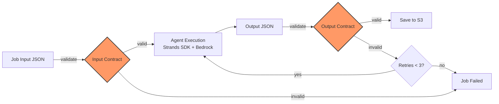

# Contract Validation

Pydantic contracts validate agent inputs and outputs at every stage.



## Validation Layers

1. **Input validation** — reject invalid input before agent runs
2. **LLM structured output** — Pydantic models enforce JSON structure during execution
3. **Output validation** — validate against contract schema, retry up to 3 times with auto-fix
4. **Checkpoint** — save to S3 after successful validation for resume capability

## Retry Strategy

```
Attempt 1: LLM generates output → validation fails
Attempt 2: Auto-fix common issues → re-validate
Attempt 3: Re-prompt LLM with error context → re-validate
Failed: Return error to user
```

## Contract Versioning

Agent version (code) and contract version (data structure) are decoupled. Agent v2.3.1 can produce contract v1.2. Version adapters handle migrations.

---

**Related:** [Agent Framework](04-agent-framework.md) | [Contracts Spec](../contracts/agent-contracts-spec.md)
