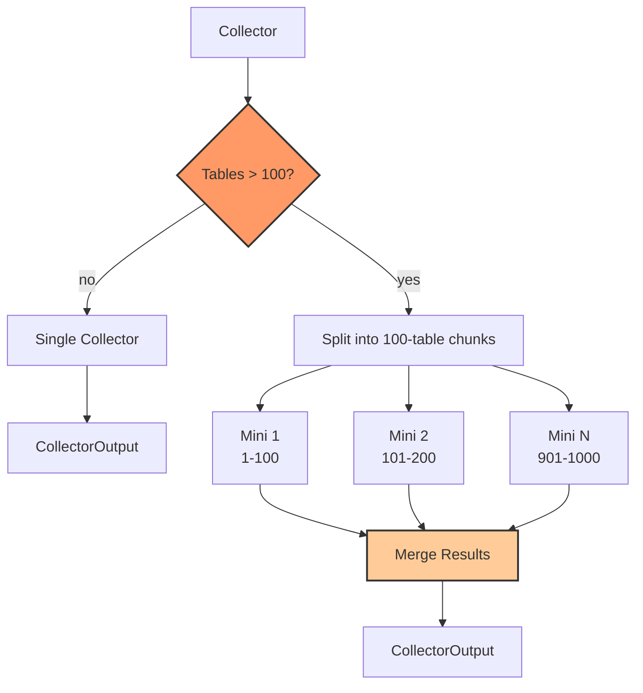

# Mini-Collectors

Parallel processing for large databases (1000+ tables).

## Performance

| Tables | Single | Mini-Collectors | Speedup |
|--------|--------|-----------------|---------|
| 100 | 15 min | 15 min | 1x |
| 1,000 | 2 hours | 15 min | 8x |
| 5,000 | 10 hours | 20 min | 30x |

## How It Works

- Threshold: >100 tables triggers splitting
- Chunk size: 100 tables per mini-collector
- Each mini-collector runs concurrently and saves its own checkpoint
- On failure: resume from the failed mini-collector only (completed ones are preserved)
- Merge: combine schemas, aggregate metrics, deduplicate query patterns

---

**Related:** [Agent Framework](04-agent-framework.md) | [Workflow Sequence](05-workflow-sequence.md)
