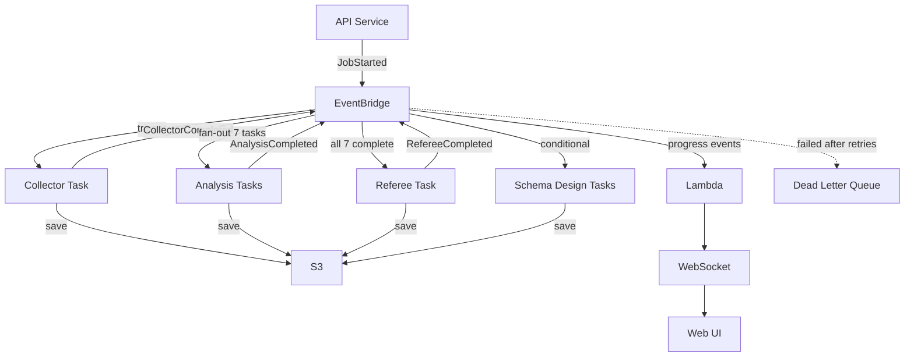

> **Status: Superseded**
> This document describes the original EventBridge-based orchestration architecture. It has been superseded by [11-orchestration-architecture.md](11-orchestration-architecture.md) per [ADR-016](../decisions/ADR-016-compute-and-orchestration-strategy.md). EventBridge now handles progress notifications only. Retained for historical context.

---

# EventBridge Orchestration

> **⚠️ Superseded by [Orchestration Architecture](11-orchestration-architecture.md)** per [ADR-016](../decisions/ADR-016-compute-and-orchestration-strategy.md). EventBridge now handles progress notifications only — Step Functions orchestrates the workflow. Retained for historical reference.

Event-driven agent orchestration using EventBridge and ECS Fargate. Agents are decoupled — they communicate through events, not direct calls.



## Event Flow

1. API publishes `JobStarted` → EventBridge triggers Collector ECS task
2. Collector saves output to S3, publishes `CollectorCompleted`
3. EventBridge fans out to 7 Analysis tasks in parallel
4. Each Analysis agent saves output to S3, publishes `AnalysisCompleted`
5. After all 7 complete, EventBridge triggers Referee task
6. Referee validates, generates report, publishes `RefereeCompleted`
7. Conditionally triggers Schema Design tasks based on referee output

## Event Patterns

```json
// Rule: Start Collector
{ "source": ["modernizer.api"], "detail-type": ["JobStarted"] }

// Rule: Fan-out Analysis
{ "source": ["modernizer.collector"], "detail-type": ["CollectorCompleted"] }

// Rule: Start Referee (after all 7 analysis agents)
{ "source": ["modernizer.analysis"], "detail-type": ["AnalysisCompleted"] }

// Rule: Progress Reporting
{ "source": ["modernizer.*"], "detail-type": ["CollectorCompleted", "AnalysisCompleted", "RefereeCompleted"] }
```

Event detail includes `job_id`, `output_location` (S3 path), and `timestamp`.

## Retry and Error Handling

- Automatic retry with exponential backoff (1s → 16s, max 5 attempts)
- Failed events after max retries go to Dead Letter Queue
- DLQ alerts for manual investigation and replay
- ECS task exit code 0 = success, 1-255 = failure (retry)

## Why EventBridge (not SQS)

| | EventBridge | SQS |
|---|---|---|
| Routing | Pattern-based | Manual per queue |
| Fan-out | Native | Requires SNS |
| Retry/DLQ | Built-in | Built-in |
| Event history | 24h archive | None |

EventBridge gives us pattern-based routing and native fan-out without extra infrastructure.

---

**Related:** [Workflow Sequence](05-workflow-sequence.md) | [Progress Reporting](10-progress-reporting.md) | [High-Level Design](../high-level-design.md)
