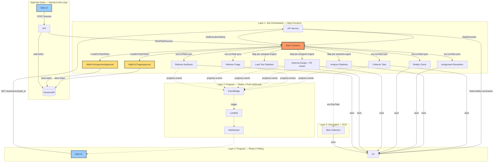

# Orchestration Architecture

Three-layer orchestration per [ADR-016](../decisions/ADR-016-compute-and-orchestration-strategy.md): Step Functions for workflow (with two human-in-the-loop approval gates — after triage and after reality check), EventBridge for notifications, agents for internal parallelism.



## Step Functions Workflow

```
StartExecution
  → RunCollector (ecs:runTask.sync, retry 2x)
  → RunRefereeTriage (ecs:runTask.sync)
  → WaitForTriageApproval (waitForTaskToken — execution pauses indefinitely)
      → token stored in DynamoDB via states:dynamodb:updateItem
      → resumes when UI calls POST /assessments/{job_id}/resume
  → RunAnalysisPipelines (Map state, per triage-selected engine):
      → RunAnalysis (ecs:runTask.sync)
  → RunAssignmentResolution (ecs:runTask.sync)
  → RunRealityCheck (ecs:runTask.sync, includes Aurora Absorption Pass)
  → WaitForAssignmentApproval (waitForTaskToken — execution pauses indefinitely)
      → token stored in DynamoDB via states:dynamodb:updateItem
      → resumes when UI calls POST /assessments/{job_id}/resume
  → RunSchemaDesignPipelines (Map state, per assigned engine):
      → RunSchemaDesign (ecs:runTask.sync, includes PE review loop)
  → RunLoadTestPipelines (Map state, per assigned engine):
      → RunLoadTest (ecs:runTask.sync, k6-based)
  → RunRefereeSynthesis (ecs:runTask.sync)
      → [deeper analysis loop, max 2 iterations — loops back to RunSchemaDesignPipelines]
  → JobComplete / JobFailed
```

Step Functions uses `ecs:runTask.sync` integration — it launches the ECS task and waits for completion. No polling needed. `WaitForTriageApproval` and `WaitForAssignmentApproval` use the `waitForTaskToken` pattern — no compute runs during the pause.

## Progress Reporting

Phase 0: UI polls `GET /api/v1/assessments/{job_id}`, API reads Step Functions execution history and S3 artifact summaries. No agent code changes needed.

Phase 1 (deferred): EventBridge `StageProgress` events → Lambda → WebSocket push.

## Agent-Owned Parallelism

Collectors decide at runtime whether to spawn mini-collectors via `ecs:RunTask`. Step Functions sees the collector as a single step. See [Mini-Collectors](09-mini-collectors.md).

---

**Related:** [Workflow Sequence](05-workflow-sequence.md) | [Progress Reporting](10-progress-reporting.md) | [ADR-016](../decisions/ADR-016-compute-and-orchestration-strategy.md)
