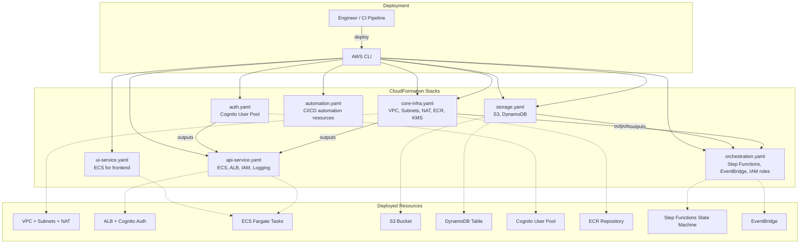

# CloudFormation Deployment

Infrastructure as Code using independent CloudFormation stacks deployed via AWS CLI or GitLab CI. No build step — templates deployed directly.



## Stack Dependencies

Stacks are independent but share values via parameters:

1. **core-infra** → deploys first (VPC, subnets, ECR, KMS key)
2. **auth** → deploys after core-infra (Cognito, no infra dependencies)
3. **storage** → depends on core-infra outputs (KMS key)
4. **orchestration** → depends on storage (S3 bucket ARN) and core-infra (VPC, subnets); provisions Step Functions state machine, EventBridge rules, and IAM execution roles
5. **api-service** → depends on core-infra outputs (VPC, subnets) and auth outputs (Cognito)
6. **ui-service** → depends on core-infra outputs (VPC, subnets)
7. **automation** → depends on core-infra outputs (ECR); provisions CI/CD automation resources

## Deploy

```bash
# Deploy in order
aws cloudformation deploy --template-file infrastructure/cloudformation/core-infra.yaml \
  --stack-name db-modernizer-dev-core-infra \
  --parameter-overrides file://infrastructure/cloudformation/parameters/dev.yaml \
  --capabilities CAPABILITY_IAM

aws cloudformation deploy --template-file infrastructure/cloudformation/auth.yaml \
  --stack-name db-modernizer-dev-auth \
  --parameter-overrides file://infrastructure/cloudformation/parameters/dev.yaml \
  --capabilities CAPABILITY_IAM

aws cloudformation deploy --template-file infrastructure/cloudformation/storage.yaml \
  --stack-name db-modernizer-dev-storage \
  --parameter-overrides file://infrastructure/cloudformation/parameters/dev.yaml

aws cloudformation deploy --template-file infrastructure/cloudformation/orchestration.yaml \
  --stack-name db-modernizer-dev-orchestration \
  --parameter-overrides file://infrastructure/cloudformation/parameters/dev.yaml \
  --capabilities CAPABILITY_IAM

aws cloudformation deploy --template-file infrastructure/cloudformation/api-service.yaml \
  --stack-name db-modernizer-dev-api-service \
  --parameter-overrides file://infrastructure/cloudformation/parameters/dev.yaml \
  --capabilities CAPABILITY_IAM

aws cloudformation deploy --template-file infrastructure/cloudformation/ui-service.yaml \
  --stack-name db-modernizer-dev-ui-service \
  --parameter-overrides file://infrastructure/cloudformation/parameters/dev.yaml \
  --capabilities CAPABILITY_IAM

aws cloudformation deploy --template-file infrastructure/cloudformation/automation.yaml \
  --stack-name db-modernizer-dev-automation \
  --parameter-overrides file://infrastructure/cloudformation/parameters/dev.yaml \
  --capabilities CAPABILITY_IAM
```

## Why CloudFormation (not CDK)

| Aspect | CloudFormation | CDK |
|--------|---------------|-----|
| Format | YAML — no build step | TypeScript — requires compilation |
| Transparency | Direct templates, easy security review | Generated templates, harder to audit |
| Toolchain | AWS CLI only | Node.js + CDK CLI |
| Customer trust | Higher — inspect before deploy | Lower — generated output |

Customers deploy this in their own accounts. They need to review exact resources before deployment. Plain YAML templates make that straightforward.

See [ADR-012](../decisions/ADR-012-cloudformation-over-cdk.md) for detailed rationale.

---

**Related:** [VPC Deployment](02-vpc-deployment.md) | [High-Level Design](../high-level-design.md)

**Last Updated:** February 13, 2026
