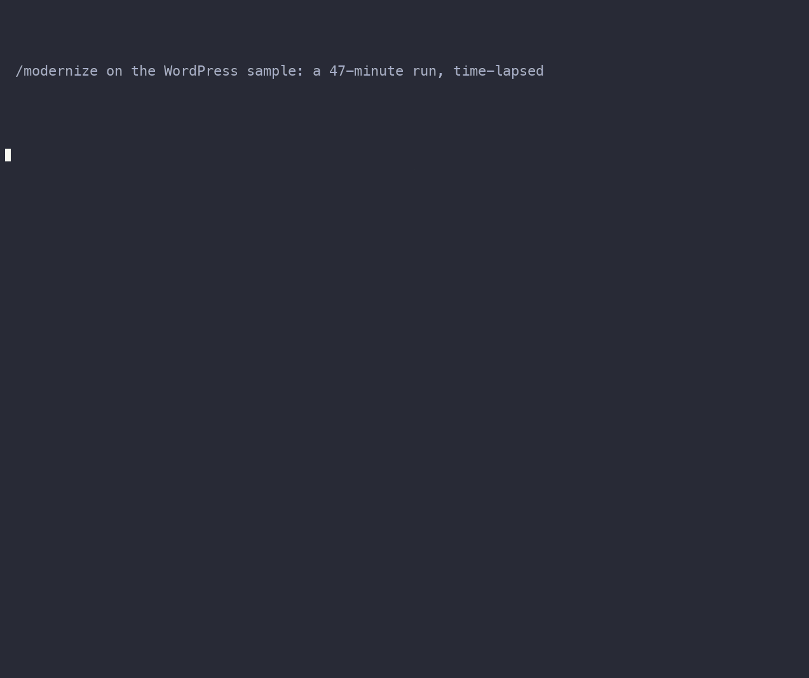

# Run a full database modernization assessment with Claude Code

Point this tool at a monolithic relational database and it tells you which queries belong on which AWS purpose-built engine, with validated, ready-to-implement schema designs.

```
/modernize docs/examples/wordpress/wordpress-collection.json
```

Run that one command inside [Claude Code](https://docs.anthropic.com/en/docs/claude-code) with this repository open, and it narrates every phase in the chat while opening a local UI next to it by default — the UI shows the assignment Sankey diagram, the schema designs, and the full report as they're produced.

[Get started with Claude Code](get-started.md){ .md-button .md-button--primary }
[See a sample report](sample.md){ .md-button }

## Demo



*A full `/modernize` run on the WordPress sample (47 minutes, time-lapsed), then the local UI: the executive summary, the query flow, the cost per engine and the access pattern explorer.*

## What it answers

- **Which queries go where.** Every query pattern is scored against each candidate engine; the assignment is deterministic, not an LLM guess.
- **What the target schemas look like.** DynamoDB tables, DocumentDB collections, OpenSearch mappings, and the relational schema that stays — all generated from the actual workload, not a generic template.
- **What it costs and what the risks are.** TCO projections and a risk analysis come out of the same pipeline run, with migration waves showing one suggested incremental path next to the fully decomposed target.

See [Understand the results](understand-the-results.md) for how to read every deliverable.

--8<-- "README.md:overview"

!!! warning "Sample project"
    This is a sample project intended for educational and evaluation purposes. It requires proper review, testing, and modification before use in production environments. Use at your own risk.
