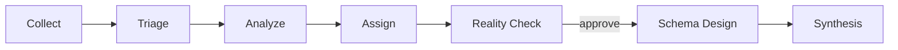

# Use Claude Code

`/modernize` is the main entry point, but each phase is also its own command, for running one step at a time or re-running a step after making a change.

## How `/modernize` works



`/modernize` resolves an experience mode — `chat`, `ui`, or `both` (the default) — and, unless the mode is `chat`, starts the local API and UI before running the pipeline. The chat always keeps the key numbers for each phase, so a chat-only user can still follow and decide; in `both` mode it also points at the matching UI view (the Sankey/assignment page at the Reality Check approval gate, the schema designs after phase 6, the full report at the end). If the UI can't start — port busy, build failure, Node missing — the run falls back to chat and keeps going rather than failing.

Use `/modernize docs/examples/wordpress/wordpress-collection.json --mode chat` for a terminal-only run: no browser, no Node required, works in headless environments.

## The individual commands

| Command | What it does |
| --- | --- |
| `/collect` | Parses collector output and initializes a job |
| `/triage` | Detects workload signals and selects candidate engines |
| `/analyze` | Runs analysis agents for every triage-selected engine |
| `/assign` | Resolves query-to-engine assignments |
| `/reality-check` | Consolidates under-committed engines and validates with a model |
| `/design-schema` | Designs target schemas per engine (needs a model) |
| `/synthesize` | Produces the final report: decision report, engineering report, executive PDF/deck |

Each command is defined in `.claude/commands/` and reads the job state from `.modernizer-state.json`, so you can run them out of order to re-do a single phase after changing an earlier decision.

## Analyzing your own database

Run the read-only collection script for your database engine instead of the sample zip:

```bash
# PostgreSQL (needs the pg_stat_statements extension)
psql -U <user> -h <host> -d <database> -t -A -f scripts/collect-postgresql.sql > my-collection.json

# MySQL (needs performance_schema)
mysql -N -u <user> -p -h <host> -D <database> < scripts/collect-mysql.sql > my-collection.json
```

The scripts only `SELECT` from `information_schema`, `pg_stat_statements`, or `performance_schema` — they never modify your database. Then run `/modernize` (or `/collect`) and point it at the generated file instead of the sample.

## Headless runs

`claude -p "/modernize <collection.json> --auto --mode <chat|ui|both>"` runs the whole pipeline with no interactive prompts — `/modernize` never asks which experience mode to use (it resolves `--mode` if given, else `both`), and `--auto` never asks anything else either. This is how CI exercises the pipeline against a real model (see `ci/e2e-llm.sh` and [AGENTS.md](https://github.com/aws-samples/sample-aws-genai-db-modernizer/blob/main/AGENTS.md#headless-rules-modernize---auto) for the full rules); it is not something most users need to run directly.
