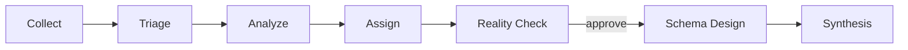

# Use Claude Code

`/modernize` is the main entry point. Each phase is also its own command, so you can run one step at a time or re-run a step after a change.

## How `/modernize` works



`/modernize` runs in one of three modes: `chat`, `ui` or `both` (the default). In `ui` and `both` it starts the local API and UI before the pipeline. The chat always shows the key numbers for each phase, so you can follow the run and decide from the chat alone. In `both` mode it also points to the matching UI view: the Sankey and assignment page at the Reality Check approval, the schema designs after phase 6, and the full report at the end. If the UI can't start (a busy port, a failed build, or no Node), the run switches to chat and continues.

Use `/modernize docs/examples/wordpress/wordpress-collection.json --mode chat` for a terminal-only run: no browser, no Node required, works in headless environments.

## The individual commands

| Command | What it does |
| --- | --- |
| `/collect` | Parses collector output and initializes a job |
| `/triage` | Detects workload signals and selects candidate engines |
| `/analyze` | Runs analysis agents for every triage-selected engine |
| `/assign` | Resolves query-to-engine assignments |
| `/reality-check` | Consolidates under-committed engines and validates with a model |
| `/design-schema` | Designs target schemas per engine (needs a model) |
| `/synthesize` | Produces the final report: decision report, engineering report, executive PDF/deck |

Each command is defined in `.claude/commands/` and reads the job state from `.modernizer-state.json`, so you can run them out of order to re-do a single phase after changing an earlier decision.

## Analyzing your own database

Run the read-only collection script for your database engine instead of the sample zip:

```bash
# PostgreSQL (needs the pg_stat_statements extension)
psql -U <user> -h <host> -d <database> -t -A -f scripts/collect-postgresql.sql > my-collection.json

# MySQL (needs performance_schema)
mysql -N -u <user> -p -h <host> -D <database> < scripts/collect-mysql.sql > my-collection.json
```

The scripts only run `SELECT` on `information_schema`, `pg_stat_statements` or `performance_schema`. They never change your database. Then run `/modernize` (or `/collect`) and point it at the generated file instead of the sample.

## Headless runs

`claude -p "/modernize <collection.json> --auto --mode <chat|ui|both>"` runs the whole pipeline without prompts. `/modernize` uses `--mode` when given and `both` otherwise, and `--auto` approves the one decision for you. CI uses this to test the pipeline against a real model; see `ci/e2e-llm.sh` and [AGENTS.md](https://github.com/aws-samples/sample-aws-genai-db-modernizer/blob/main/AGENTS.md#headless-rules-modernize---auto) for the full rules. Most users don't need it.
