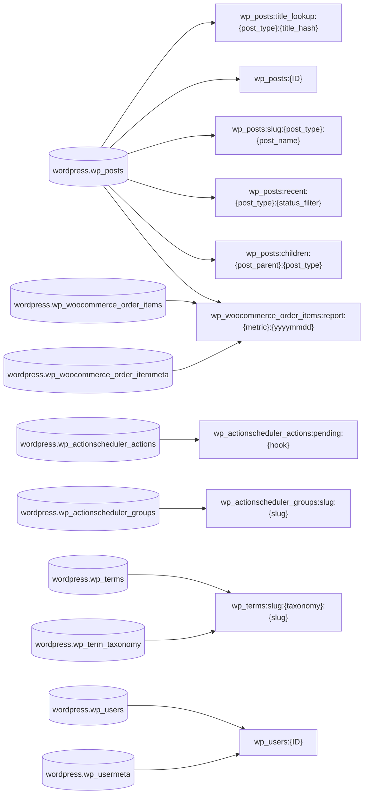
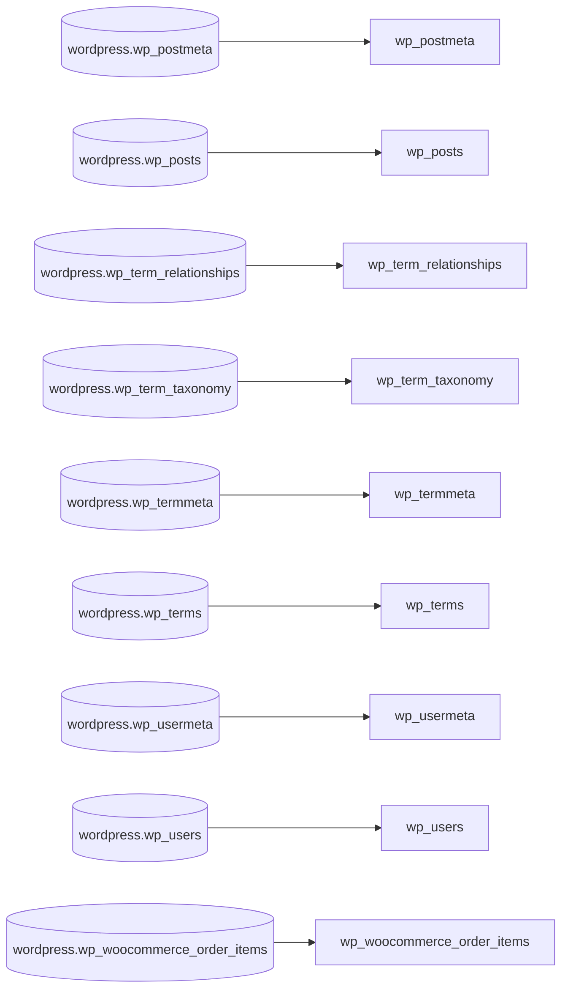

# Database Modernization — Engineering Report

Source database: `wordpress`. This is the build companion to the Decision Report: the source-to-target mapping, the per-engine target schemas, and the query co-dependency groups.

## Migration map (22 tables)

| Source table | Target engine | Target | Pattern | Confidence |
|---|---|---|---|---|
| `wordpress.wp_actionscheduler_actions` | dynamodb | `WpActionSchedulerActions` | separate | 85 |
| `wordpress.wp_actionscheduler_groups` | dynamodb | `WpActionSchedulerActions` | separate | 90 |
| `wordpress.wp_actionscheduler_logs` | dynamodb | `ActionSchedulerLogs` | separate | 72 |
| `wordpress.wp_commentmeta` | dynamodb | `CommentMeta` | identifying_relationship | 64 |
| `wordpress.wp_comments` | dynamodb | `Comments` | separate | 71 |
| `wordpress.wp_options` | dynamodb | `wp_options` | separate | 89 |
| `wordpress.wp_postmeta` | aurora_mysql | `wp_postmeta` | relational_table | 81 |
| `wordpress.wp_posts` | dynamodb | `WpPosts` | item_collection | 82 |
| `wordpress.wp_term_relationships` | dynamodb | `WpPosts` | item_collection | 86 |
| `wordpress.wp_term_taxonomy` | dynamodb | `WpPosts` | item_collection | 84 |
| `wordpress.wp_termmeta` | dynamodb | `WpTerms` | item_collection | 85 |
| `wordpress.wp_terms` | dynamodb | `WpPosts` | item_collection | 85 |
| `wordpress.wp_usermeta` | elasticache | `wp_users:{ID}` | hash | 84 |
| `wordpress.wp_users` | dynamodb | `wp_users` | separate | 89 |
| `wordpress.wp_wc_admin_notes` | dynamodb | `AdminNotes` | separate | 62 |
| `wordpress.wp_wc_product_meta_lookup` | dynamodb | `ProductMetaLookup` | separate | 69 |
| `wordpress.wp_wc_reserved_stock` | dynamodb | `ReservedStock` | identifying_relationship | 72 |
| `wordpress.wp_wc_tax_rate_classes` | dynamodb | `TaxRateClasses` | separate | 95 |
| `wordpress.wp_woocommerce_api_keys` | dynamodb | `ApiKeys` | separate | 95 |
| `wordpress.wp_woocommerce_downloadable_product_permissions` | dynamodb | `DownloadablePermissions` | separate | 69 |
| `wordpress.wp_woocommerce_order_itemmeta` | dynamodb | `WpOrderItems` | item_collection | 79 |
| `wordpress.wp_woocommerce_order_items` | elasticache | `wp_woocommerce_order_items:report:{metric}:{yyyymmdd}` | hash | 83 |

## Target schemas by engine

### dynamodb (20 target objects, 52 access patterns)

| Target | Pattern | Source tables | GSIs |
|---|---|---|---|
| `WpActionSchedulerActions` | separate | `wordpress.wp_actionscheduler_actions`, `wordpress.wp_actionscheduler_groups` | 0 |
| `WpOrderItems` | item_collection | `wordpress.wp_woocommerce_order_items`, `wordpress.wp_woocommerce_order_itemmeta` | 1 |
| `WpPosts` | item_collection | `wordpress.wp_posts`, `wordpress.wp_postmeta`, `wordpress.wp_term_relationships`, `wordpress.wp_term_taxonomy`, `wordpress.wp_terms` | 2 |
| `WpTerms` | item_collection | `wordpress.wp_terms`, `wordpress.wp_term_taxonomy`, `wordpress.wp_termmeta` | 0 |
| `wp_postmeta` | identifying_relationship | `wordpress.wp_postmeta` | 0 |
| `wp_posts` | separate | `wordpress.wp_posts` | 1 |
| `wp_term_relationships` | identifying_relationship | `wordpress.wp_term_relationships`, `wordpress.wp_term_taxonomy`, `wordpress.wp_terms` | 0 |
| `wp_termmeta` | identifying_relationship | `wordpress.wp_termmeta` | 0 |
| `wp_terms_taxonomy` | item_collection | `wordpress.wp_terms`, `wordpress.wp_term_taxonomy` | 1 |
| `wp_users` | separate | `wordpress.wp_users` | 0 |
| `wp_options` | separate | `wordpress.wp_options` | 1 |
| `ActionSchedulerLogs` | separate | `wordpress.wp_actionscheduler_logs` | 0 |
| `AdminNotes` | separate | `wordpress.wp_wc_admin_notes` | 0 |
| `ApiKeys` | separate | `wordpress.wp_woocommerce_api_keys` | 1 |
| `CommentMeta` | identifying_relationship | `wordpress.wp_commentmeta` | 0 |
| `Comments` | separate | `wordpress.wp_comments` | 0 |
| `DownloadablePermissions` | separate | `wordpress.wp_woocommerce_downloadable_product_permissions` | 0 |
| `ProductMetaLookup` | separate | `wordpress.wp_wc_product_meta_lookup` | 0 |
| `ReservedStock` | identifying_relationship | `wordpress.wp_wc_reserved_stock` | 0 |
| `TaxRateClasses` | separate | `wordpress.wp_wc_tax_rate_classes` | 2 |

**Unsupported patterns (3):**

- **aggregation** (`254f282c`, `f7de9a81`) — COUNT and SUM have no server-side equivalent in DynamoDB. Compute application-side from Query results on wp\_postmeta, maintain materialized counters or totals with UpdateItem, or move to an analytics pipeline \(DynamoDB export to S3 with Athena\).
- **aggregation** (`8c66eaee`, `f6438457`) — COUNT\(\*\) aggregations cannot be served by DynamoDB. Maintain per-post approved-comment counters and per-type/status admin note counters via UpdateItem \(or DynamoDB Streams + Lambda\), or compute in the application / export to S3 + Athena.
- **aggregation** (`aa03c203`) — SELECT FOUND\_ROWS\(\) is a MySQL session function \(unknown table\) returning the total row count of a previous query. Replace with application-side pagination using LastEvaluatedKey or a maintained counter; out of scope for DynamoDB.

_ER diagram omitted (20 target objects); see the table above._

### elasticache (10 target objects, 13 access patterns)

| Target | Pattern | Source tables | GSIs | TTL(s) |
|---|---|---|---|---|
| `wp_posts:title_lookup:{post_type}:{title_hash}` | string | `wordpress.wp_posts` | 0 | 300 |
| `wp_posts:{ID}` | hash | `wordpress.wp_posts` | 0 | 900 |
| `wp_posts:slug:{post_type}:{post_name}` | string | `wordpress.wp_posts` | 0 | 600 |
| `wp_posts:recent:{post_type}:{status_filter}` | sorted_set | `wordpress.wp_posts` | 0 | 300 |
| `wp_posts:children:{post_parent}:{post_type}` | sorted_set | `wordpress.wp_posts` | 0 | 300 |
| `wp_actionscheduler_actions:pending:{hook}` | sorted_set | `wordpress.wp_actionscheduler_actions` | 0 | 60 |
| `wp_actionscheduler_groups:slug:{slug}` | string | `wordpress.wp_actionscheduler_groups` | 0 | 3600 |
| `wp_terms:slug:{taxonomy}:{slug}` | string | `wordpress.wp_terms`, `wordpress.wp_term_taxonomy` | 0 | 3600 |
| `wp_woocommerce_order_items:report:{metric}:{yyyymmdd}` | hash | `wordpress.wp_posts`, `wordpress.wp_woocommerce_order_items`, `wordpress.wp_woocommerce_order_itemmeta` | 0 | 900 |
| `wp_users:{ID}` | hash | `wordpress.wp_users`, `wordpress.wp_usermeta` | 0 | 1800 |

**Unsupported patterns (2):**

- **unsupported pattern** (`59163c18`) — Join between actions and groups with LIKE filters on hook, args and extended\_args and a claim\_id predicate; arbitrary pattern matching is not supported by Redis. Keep in Aurora MySQL, or split into the group slug lookup and per-hook pending sorted sets and filter args in the application.
- **unsupported pattern** (`b065d0f3`) — SHOW FULL FIELDS is a schema introspection statement with no Redis equivalent. Application should not introspect schema at runtime after migration.

**Migration notes:**

- **transaction** SQL\_CALC\_FOUND\_ROWS pagination — Replace SQL\_CALC\_FOUND\_ROWS with ZCARD on the listing sorted set, issued in the same pipeline as ZREVRANGE.
- **procedure** order report aggregation — A cache-miss loader must run the aggregation against the source database and populate the per-day report hashes; Redis does not compute joins or GROUP BY.

### aurora\_mysql (9 target objects, 0 access patterns)

| Target | Pattern | Source tables | GSIs |
|---|---|---|---|
| `wp_postmeta` | relational_table | `wordpress.wp_postmeta` | 0 |
| `wp_posts` | relational_table | `wordpress.wp_posts` | 0 |
| `wp_term_relationships` | relational_table | `wordpress.wp_term_relationships` | 0 |
| `wp_term_taxonomy` | relational_table | `wordpress.wp_term_taxonomy` | 0 |
| `wp_termmeta` | relational_table | `wordpress.wp_termmeta` | 0 |
| `wp_terms` | relational_table | `wordpress.wp_terms` | 0 |
| `wp_usermeta` | relational_table | `wordpress.wp_usermeta` | 0 |
| `wp_users` | relational_table | `wordpress.wp_users` | 0 |
| `wp_woocommerce_order_items` | relational_table | `wordpress.wp_woocommerce_order_items` | 0 |

## Query co-dependency groups (29)

| Group | Engines | Access patterns | Source queries | Design RPS |
|---|---|---|---|---|
| Option lookups | dynamodb | 2 | 2 | 85.95623842592592 |
| Post meta reads | dynamodb | 3 | 3 | 32.394166 |
| Post reads | dynamodb | 5 | 5 | 17.463312000000002 |
| Order item meta reads | dynamodb | 3 | 3 | 17.019652999999998 |
| Term lookups | dynamodb | 4 | 4 | 15.406906999999999 |
| API key maintenance | dynamodb | 1 | 1 | 8.276493 |
| Post meta writes | dynamodb | 4 | 4 | 4.327396 |
| Option writes | dynamodb | 3 | 3 | 4.297083333333333 |
| Action scheduler reads | dynamodb | 1 | 1 | 3.590301 |
| Order item reads | dynamodb | 1 | 1 | 3.284236 |
| Order item meta writes | dynamodb | 1 | 1 | 1.922257 |
| Autoload option reads | dynamodb | 1 | 1 | 1.4381944444444446 |
| Tax rate class reads | dynamodb | 1 | 1 | 1.263333 |
| User lookups | dynamodb | 2 | 2 | 0.9521 |
| API key lookups | dynamodb | 1 | 1 | 0.827546 |
| Term metadata reads | dynamodb | 2 | 2 | 0.7861 |
| Post metadata reads | dynamodb | 3 | 3 | 0.7029000000000001 |
| Pagination counts | dynamodb | 1 | 1 | 0.677593 |
| Object term relationships | dynamodb | 3 | 3 | 0.5687 |
| Comment CRUD | dynamodb | 2 | 2 | 0.532442 |
| Product lookup writes | dynamodb | 1 | 1 | 0.356481 |
| Comment counts | dynamodb | 1 | 1 | 0.266215 |
| Term meta writes | dynamodb | 1 | 1 | 0.178623 |
| Stock reservation | dynamodb | 1 | 1 | 0.151736 |
| Action scheduler logs | dynamodb | 1 | 1 | 0.09713 |
| Download permissions | dynamodb | 1 | 1 | 0.097118 |
| Comment metadata | dynamodb | 1 | 1 | 0.049109 |
| Admin note counts | dynamodb | 1 | 1 | 0.043414 |
| ungrouped | elasticache | 13 | 0 | 0 |

## Risk register (11)

### dynamodb

- **RISK-001** · HIGH · performance degradation — Complex GROUP BY / HAVING / multi-table aggregations. DynamoDB doesn't support server-side aggregation — these need to move to application layer, pre-computed aggregates, or a separate analytics store. \(0% of queries resolved by schema design, 9 remaining\)
  - Mitigation: Pre-compute aggregates on write \(DynamoDB Streams + Lambda\), or export to S3/Athena for analytics.
  - Affects: `wordpress.wp_posts`, `wordpress.wp_woocommerce_order_itemmeta`, `wordpress.wp_woocommerce_order_items`
- **RISK-002** · MEDIUM · migration complexity — aggregation: COUNT and SUM have no server-side equivalent in DynamoDB. Compute application-side from Query results on wp\_postmeta, maintain materialized counters or totals with UpdateItem, or move to an analytics pipeline \(DynamoDB export to S3 with Athena\).
  - Mitigation: COUNT and SUM have no server-side equivalent in DynamoDB. Compute application-side from Query results on wp\_postmeta, maintain materialized counters or totals with UpdateItem, or move to an analytics pipeline \(DynamoDB export to S3 with Athena\).
- **RISK-003** · MEDIUM · migration complexity — aggregation: COUNT\(\*\) aggregations cannot be served by DynamoDB. Maintain per-post approved-comment counters and per-type/status admin note counters via UpdateItem \(or DynamoDB Streams + Lambda\), or compute in the application / export to S3 + Athena.
  - Mitigation: COUNT\(\*\) aggregations cannot be served by DynamoDB. Maintain per-post approved-comment counters and per-type/status admin note counters via UpdateItem \(or DynamoDB Streams + Lambda\), or compute in the application / export to S3 + Athena.
- **RISK-004** · MEDIUM · migration complexity — aggregation: SELECT FOUND\_ROWS\(\) is a MySQL session function \(unknown table\) returning the total row count of a previous query. Replace with application-side pagination using LastEvaluatedKey or a maintained counter; out of scope for DynamoDB.
  - Mitigation: SELECT FOUND\_ROWS\(\) is a MySQL session function \(unknown table\) returning the total row count of a previous query. Replace with application-side pagination using LastEvaluatedKey or a maintained counter; out of scope for DynamoDB.

### elasticache

- **RISK-005** · MEDIUM · migration complexity — unsupported pattern: Join between actions and groups with LIKE filters on hook, args and extended\_args and a claim\_id predicate; arbitrary pattern matching is not supported by Redis. Keep in Aurora MySQL, or split into the group slug lookup and per-hook pending sorted sets and filter args in the application.
  - Mitigation: Keep in Aurora MySQL, or split into the group slug lookup and per-hook pending sorted sets and filter args in the application.
- **RISK-006** · MEDIUM · migration complexity — unsupported pattern: SHOW FULL FIELDS is a schema introspection statement with no Redis equivalent. Application should not introspect schema at runtime after migration.
  - Mitigation: Application should not introspect schema at runtime after migration.
- **RISK-007** · MEDIUM · operational risk — transaction: SQL\_CALC\_FOUND\_ROWS pagination — Replace SQL\_CALC\_FOUND\_ROWS with ZCARD on the listing sorted set, issued in the same pipeline as ZREVRANGE.
  - Mitigation: Implement as application logic: Replace SQL\_CALC\_FOUND\_ROWS with ZCARD on the listing sorted set, issued in the same pipeline as ZREVRANGE.
  - Affects: `wordpress.wp_posts`
- **RISK-008** · MEDIUM · operational risk — procedure: order report aggregation — A cache-miss loader must run the aggregation against the source database and populate the per-day report hashes; Redis does not compute joins or GROUP BY.
  - Mitigation: Implement as application logic: A cache-miss loader must run the aggregation against the source database and populate the per-day report hashes; Redis does not compute joins or GROUP BY.
  - Affects: `wordpress.wp_woocommerce_order_items`

### aurora\_mysql

- **RISK-009** · HIGH · performance degradation — Single-row SELECT by primary key at very high frequency \(&gt;100 calls/second\). DynamoDB provides single-digit millisecond latency for key-value lookups at any scale — Aurora adds unnecessary overhead for this access pattern. \(0% of queries resolved by schema design, 1 remaining\)
  - Mitigation: Migrate high-frequency PK lookups to DynamoDB for predictable sub-millisecond latency at scale.
  - Affects: `wordpress.wp_options`
- **RISK-010** · MEDIUM · performance degradation — Table with no foreign keys and no join participation — all queries are single-table CRUD. This workload has no structural relational requirement and could run on a simpler, purpose-built engine \(DynamoDB for key-value, ElastiCache for hot lookups\). \(0% of queries resolved by schema design, 18 remaining\)
  - Mitigation: Evaluate whether this table benefits from Aurora's relational features. If it's purely key-value access, DynamoDB offers better cost/performance. If it's a hot lookup, ElastiCache is more appropriate.
  - Affects: `wordpress.wp_actionscheduler_logs`, `wordpress.wp_commentmeta`, `wordpress.wp_comments`, `wordpress.wp_wc_admin_notes`, `wordpress.wp_wc_product_meta_lookup`, `wordpress.wp_wc_reserved_stock`, `wordpress.wp_wc_tax_rate_classes`, `wordpress.wp_woocommerce_api_keys` (+1 more)
- **RISK-011** · MEDIUM · performance degradation — Table accessed by at most 2 distinct query patterns, all single-table, all by primary key or single column filter. This is a key-value workload wearing a relational costume — no query optimizer benefit. \(0% of queries resolved by schema design, 10 remaining\)
  - Mitigation: Consider DynamoDB for simple key-value access or ElastiCache for sub-millisecond lookups. Aurora adds connection overhead and query parsing cost for access patterns that don't need them.
  - Affects: `unknown`, `wordpress.wp_actionscheduler_logs`, `wordpress.wp_commentmeta`, `wordpress.wp_wc_admin_notes`, `wordpress.wp_wc_product_meta_lookup`, `wordpress.wp_wc_reserved_stock`, `wordpress.wp_wc_tax_rate_classes`, `wordpress.wp_woocommerce_api_keys` (+1 more)

## Migration trade-offs (38)

### dynamodb

- **wp\_posts, wp\_postmeta and wp\_term\_relationships are stored as one item collection keyed by post\_id instead of separate tables.** — Reading a post and all of its metadata is one key lookup, but items of different types share one table, so backup and scaling settings are shared and the ORDER BY meta\_id ordering is replaced by meta\_key then meta\_id ordering \(the application sorts by meta\_id if needed\).
  - Affects: `wordpress.wp_posts`, `wordpress.wp_postmeta`, `wordpress.wp_term_relationships`
- **The three-table join of terms, term\_taxonomy and term\_relationships is replaced by denormalized POST\_TERM items \(term\_id, taxonomy, term\_name\) under each post.** — The term lookup no longer needs a JOIN, but renaming a term requires updating every POST\_TERM item that copies the name, and results are name-sorted by the application.
  - Affects: `wordpress.wp_terms`, `wordpress.wp_term_taxonomy`, `wordpress.wp_term_relationships`
- **wp\_terms, wp\_term\_taxonomy and wp\_termmeta are combined into one item collection keyed by term\_id, with the taxonomy value in the sort key.** — The scan-prone join on term\_id becomes a key lookup. The unique \(term\_id, taxonomy\) constraint is enforced by the key itself; the term\_taxonomy\_id is kept as an attribute but has no lookup index \(no observed query uses it\).
  - Affects: `wordpress.wp_terms`, `wordpress.wp_term_taxonomy`, `wordpress.wp_termmeta`
- **Meta updates and existence checks by \(owner id, meta\_key\) use a Query on the sort key prefix because meta\_key is not unique per owner and meta\_id is part of the sort key.** — An update becomes a lookup followed by an UpdateItem \(two calls instead of one SQL statement\); increment and decrement updates \(meta\_value = meta\_value +/- ?\) treat the string meta\_value as a number in the application and should use a conditional write on the previous value.
  - Affects: `wordpress.wp_postmeta`, `wordpress.wp_termmeta`, `wordpress.wp_woocommerce_order_itemmeta`
- **IN \(...\) batch lookups on post, term and order item ids become one Query per id \(or BatchGetItem where full keys are known\).** — A batch of N ids costs N requests that can run in parallel instead of one SQL statement; per-request latency stays single-digit milliseconds.
  - Affects: `wordpress.wp_postmeta`, `wordpress.wp_woocommerce_order_itemmeta`, `wordpress.wp_terms`
- **Two GSIs \(PostsByParent, PostsByName\) on WpPosts replace the post\_parent and post\_name indexes; both are sparse because only POST items carry the key attributes.** — GSI reads are eventually consistent, so a slug uniqueness check can briefly miss a just-written post; uniqueness of post\_name per post\_type is enforced by the application. Empty-string post\_name/post\_parent must be omitted during ETL since DynamoDB keys cannot be empty.
  - Affects: `wordpress.wp_posts`
- **The multi-value post\_status OR filter in the post\_parent query is applied as a filter expression on the PostsByParent index \(status projected via INCLUDE\).** — Filtered-out items are still read and billed, which is cheap here because the query returns about zero rows on average.
  - Affects: `wordpress.wp_posts`
- **Order items and their itemmeta share WpOrderItems keyed by order\_item\_id; listing items by order\_id uses the OrderItemsByOrder GSI.** — Item metadata loads are a single-partition Query. The order-to-items listing is eventually consistent via the GSI, and order\_id is a foreign key that is no longer enforced by the database.
  - Affects: `wordpress.wp_woocommerce_order_items`, `wordpress.wp_woocommerce_order_itemmeta`
- **The action group slug is copied into each scheduler action instead of keeping wp\_actionscheduler\_groups as a separate table; other action indexes \(status, hook, scheduled date, claim\) have no observed queries in this group and are not created.** — Fetching an action with its group is one GetItem. Renaming a group means rewriting its actions, and queue-style queries by status or schedule time will need new indexes if they are added later.
  - Affects: `wordpress.wp_actionscheduler_actions`, `wordpress.wp_actionscheduler_groups`
- **wp\_terms and wp\_term\_taxonomy are merged into one item collection keyed by term\_id, and term name is copied onto taxonomy items and relationship items.** — Term lookups by taxonomy and name no longer need a JOIN, but renaming a term requires updating its taxonomy item and all relationship items that carry the copied name.
  - Affects: `wordpress.wp_terms`, `wordpress.wp_term_taxonomy`, `wordpress.wp_term_relationships`
- **The unique \(term\_id, taxonomy\) constraint on wp\_term\_taxonomy is enforced by using SK TAXONOMY#{taxonomy} under PK term\_id; uniqueness of term\_taxonomy\_id is not enforced by a key and is left to the application.** — The database rejects duplicate taxonomy assignments for a term with a conditional put, but term\_taxonomy\_id values must be generated by the application since there is no auto-increment.
  - Affects: `wordpress.wp_term_taxonomy`
- **Three-table JOINs over terms, taxonomy and relationships are replaced by a single Query on wp\_term\_relationships using denormalized term\_id, taxonomy and term\_name; DISTINCT and ORDER BY name are applied in the application.** — Results come back in term\_taxonomy\_id order and the application must sort by name and de-duplicate, trading SQL convenience for single-digit-millisecond reads.
  - Affects: `wordpress.wp_terms`, `wordpress.wp_term_taxonomy`, `wordpress.wp_term_relationships`
- **Meta tables use PK=parent id with a composite SK meta\_key#meta\_id, replacing the meta\_key and parent indexes and eliminating full table scans on wp\_termmeta.** — Lookups by parent and meta key become prefix queries; WordPress allows multiple rows per meta key, which stay distinct through the meta\_id suffix. Cross-parent lookups by meta\_key alone are no longer supported.
  - Affects: `wordpress.wp_postmeta`, `wordpress.wp_termmeta`
- **COUNT and SUM queries on wp\_postmeta are moved to unsupported\_patterns.** — DynamoDB cannot aggregate on the server, so the application must count or sum Query results, keep a materialized counter, or use an analytics pipeline.
  - Affects: `wordpress.wp_postmeta`, `wordpress.wp_posts`
- **Slug lookups on wp\_posts use the PostsBySlug GSI with KEYS\_ONLY projection, and post\_type and ID exclusion are applied as filters after a GetItem.** — GSI reads are eventually consistent, so a just-published post may briefly not resolve by slug; the full post requires a follow-up GetItem.
  - Affects: `wordpress.wp_posts`
- **IN \(...\) lookups on wp\_posts and wp\_users become BatchGetItem calls by primary key; user\_login, user\_email and user\_nicename have no observed lookups and get no GSI.** — Batches are capped at 100 keys per call and may return unprocessed keys that must be retried; login and email lookups would need a new GSI if introduced later.
  - Affects: `wordpress.wp_posts`, `wordpress.wp_users`
- **wp\_options uses the unique option\_name as the partition key instead of the auto-increment option\_id.** — Every application lookup, update and delete goes by option name, so option\_id becomes a plain attribute and is no longer unique-enforced; uniqueness of option\_name is enforced natively by the key.
  - Affects: `wordpress.wp_options`
- **The MySQL non-unique autoload index is replaced by the OptionsByAutoload GSI, which carries option\_value so the bootstrap query needs no follow-up GetItem.** — GSI reads are eventually consistent, so a just-written option may briefly be missing from the autoload bulk load; updates to option\_value also cost an extra GSI write, and all items with autoload=yes share one GSI partition \(low traffic, well within limits\).
  - Affects: `wordpress.wp_options`
- **The INSERT ... ON DUPLICATE KEY UPDATE upsert maps to an unconditional PutItem that replaces the whole item.** — Behaviour matches the SQL upsert for all columns, but concurrent writers follow last-write-wins semantics without row locks; add conditional expressions if the application relies on lock behavior.
  - Affects: `wordpress.wp_options`
- **The SHOW FULL FIELDS metadata statement \(query\_type OTHER\) is not modeled as an access pattern.** — DynamoDB is schemaless, so schema introspection calls from the application layer have no equivalent and should be removed or replaced with DescribeTable.
  - Affects: `wordpress.wp_options`
- **The full-table scan ordered by name on wp\_wc\_tax\_rate\_classes is replaced by a Query on a GSI whose partition key is a constant attribute \(list\_scope='ALL'\) and sort key is name.** — All reads of this list hit one partition key value, which is harmless for a 2-item reference table at about 1.3 requests per second, but this constant-key pattern must not be reused for large or high-traffic tables. The GSI is eventually consistent.
  - Affects: `wordpress.wp_wc_tax_rate_classes`
- **The unique slug index on wp\_wc\_tax\_rate\_classes is served by the TaxRateClassBySlug GSI \(KEYS\_ONLY\) and uniqueness is enforced at the application layer.** — Uniqueness for slug is enforced at the application layer rather than the database layer; DynamoDB GSIs cannot enforce uniqueness. If strict database-level enforcement is required, a dedicated lookup table with TransactWriteItems can be added.
  - Affects: `wordpress.wp_wc_tax_rate_classes`
- **API key authentication by consumer\_key uses a GSI with INCLUDE projection \(user\_id, permissions, consumer\_secret, nonces\) so no follow-up GetItem is needed.** — Authentication reads are served in a single call, at the cost of duplicating about 1.2 KB per key in the index and eventual consistency on key creation or revocation \(a newly revoked key may be readable briefly\).
  - Affects: `wordpress.wp_woocommerce_api_keys`
- **The frequent last\_access UPDATE on API keys \(8.3/s, 46.7% lock time in MySQL\) becomes a plain UpdateItem on key\_id; last\_access is not projected into the GSI so there is no index write amplification.** — Row-lock contention disappears, but each update rewrites a ~1.5 KB item \(2 WCU\). Only about 1.6% of MySQL updates changed a row, so the application should use a conditional or throttled update \(for example only when last\_access is older than a threshold\) to cut write cost.
  - Affects: `wordpress.wp_woocommerce_api_keys`
- **Bulk DELETE/UPDATE by order\_id on reserved stock and download permissions become a Query on PK=order\_id followed by per-item BatchWriteItem or UpdateItem calls.** — A single SQL statement that touched many rows atomically becomes several API calls that are not atomic unless wrapped in TransactWriteItems \(limited to 100 items\); the application must handle partial failure and retries.
  - Affects: `wordpress.wp_wc_reserved_stock`, `wordpress.wp_woocommerce_downloadable_product_permissions`
- **wp\_commentmeta is modeled as an identifying relationship \(PK=comment\_id, SK=meta\_id\) and the IN \(...\) lookup becomes one Query per comment id.** — A single multi-id SQL call turns into N parallel Queries issued by the application; fine for small batches, with results ordered by meta\_id within each comment.
  - Affects: `wordpress.wp_commentmeta`
- **COUNT\(\*\) queries on wp\_comments and wp\_wc\_admin\_notes and the SELECT FOUND\_ROWS\(\) call \(unknown table\) are moved to unsupported\_patterns, and no GSI is created for comment\_post\_ID or admin note type/status.** — Comment counts per post, admin-note badge counts and pagination totals must be computed in the application or maintained as counters; they can no longer be obtained from an ad hoc SQL query.
  - Affects: `wordpress.wp_comments`, `wordpress.wp_wc_admin_notes`, `unknown`

### elasticache

- **Caches sit in front of the relational source of truth with TTL-based staleness rather than being the primary store.** — Readers may see data up to the TTL old \(seconds to minutes\); in exchange the hottest lookups drop from database round trips to sub-millisecond reads.
  - Affects: `wordpress.wp_posts`, `wordpress.wp_actionscheduler_actions`
- **Post listings are stored as ID-only sorted sets and full rows in separate hashes.** — Avoids copying large post content into many lists, but a page view needs a second pipelined read and the application must keep both in sync.
  - Affects: `wordpress.wp_posts`
- **Order reports are precomputed per day instead of joined at query time.** — Dashboards become fast and cheap, but figures lag by the refresh interval and a loader job must be built and maintained.
  - Affects: `wordpress.wp_posts`, `wordpress.wp_woocommerce_order_items`, `wordpress.wp_woocommerce_order_itemmeta`
- **Action scheduler lookups with LIKE/args filtering are left in the relational database.** — The heaviest query \(about 2M ms total time\) is not accelerated by Redis directly; teams keep that path on the database or redesign it.
  - Affects: `wordpress.wp_actionscheduler_actions`, `wordpress.wp_actionscheduler_groups`

### aurora\_mysql

- **Carry over the MySQL schema 1:1 to Aurora MySQL using the deterministic draft \(types, primary keys, indexes, no foreign keys\), adding only Aurora-level optimizations.** — Lowest-risk path: WordPress and WooCommerce keep working unchanged on a managed, MySQL-compatible engine with no application rewrite. The cost is that existing quirks of the WordPress schema \(meta tables, zero-date defaults, an oddly ordered index\) are inherited rather than fixed.
  - Affects: `wp_postmeta`, `wp_posts`, `wp_term_relationships`, `wp_term_taxonomy`, `wp_termmeta`, `wp_terms`, `wp_usermeta`, `wp_users` (+1 more)
- **Draft maps LONGTEXT to TEXT and drops UNSIGNED on integer ids; these were kept unchanged rather than overridden.** — Values larger than 64 KB \(long posts, serialized meta\) would be rejected or truncated unless verified before cutover. A pre-migration length check is required; widening a column afterward is a quick change but must be done before data load to avoid rework.
  - Affects: `wp_posts`, `wp_postmeta`, `wp_termmeta`, `wp_usermeta`, `wp_term_taxonomy`

### reality-check

- **Consolidated 11 queries from aurora\_mysql → dynamodb: Partial consolidation: 11 of 25 aurora\_mysql queries moved to dynamodb; 7 redirected to aurora\_mysql. Saves ~$550/mo in operational overhead by avoiding a dedicated aurora\_mysql cluster.** — Consolidated 11 queries from aurora\_mysql → dynamodb: Partial consolidation: 11 of 25 aurora\_mysql queries moved to dynamodb; 7 redirected to aurora\_mysql. Saves ~$550/mo in operational overhead by avoiding a dedicated aurora\_mysql cluster.
- **Consolidated 6 queries from documentdb → dynamodb: documentdb provides no unique capabilities — 6 queries can be served by existing engines. Saves ~$500/mo in operational overhead by avoiding a dedicated documentdb cluster.** — Consolidated 6 queries from documentdb → dynamodb: documentdb provides no unique capabilities — 6 queries can be served by existing engines. Saves ~$500/mo in operational overhead by avoiding a dedicated documentdb cluster.
- **Consolidated 3 queries from opensearch → aurora\_mysql: Aurora absorption: opensearch carries only 3 queries and aurora\_mysql serves them \(fit 80-81, via text\_search\_basic\), so a dedicated opensearch deployment is not justified. Saves ~$450/mo in operational overhead by avoiding a dedicated opensearch cluster.** — Consolidated 3 queries from opensearch → aurora\_mysql: Aurora absorption: opensearch carries only 3 queries and aurora\_mysql serves them \(fit 80-81, via text\_search\_basic\), so a dedicated opensearch deployment is not justified. Saves ~$450/mo in operational overhead by avoiding a dedicated opensearch cluster.
- **Recommended pattern: Command Query Responsibility Segregation \(CQRS\). Use dynamodb for all write operations and elasticache for specialized reads. Separate write operations \(commands\) from read operations \(queries\) across different databases. The write database is optimized for transactional consistency, while the read database is optimized for query performance and flexibility.** — Recommended pattern: Command Query Responsibility Segregation \(CQRS\). Use dynamodb for all write operations and elasticache for specialized reads. Separate write operations \(commands\) from read operations \(queries\) across different databases. The write database is optimized for transactional consistency, while the read database is optimized for query performance and flexibility.
- **Recommended pattern: Polyglot Persistence. Use different databases for different bounded contexts within the application. Each service/module owns its data in the database best suited for its access patterns.** — Recommended pattern: Polyglot Persistence. Use different databases for different bounded contexts within the application. Each service/module owns its data in the database best suited for its access patterns.

---

Assignments are deterministic. The complete machine-readable assessment is the Assessment Data (JSON) artifact.
